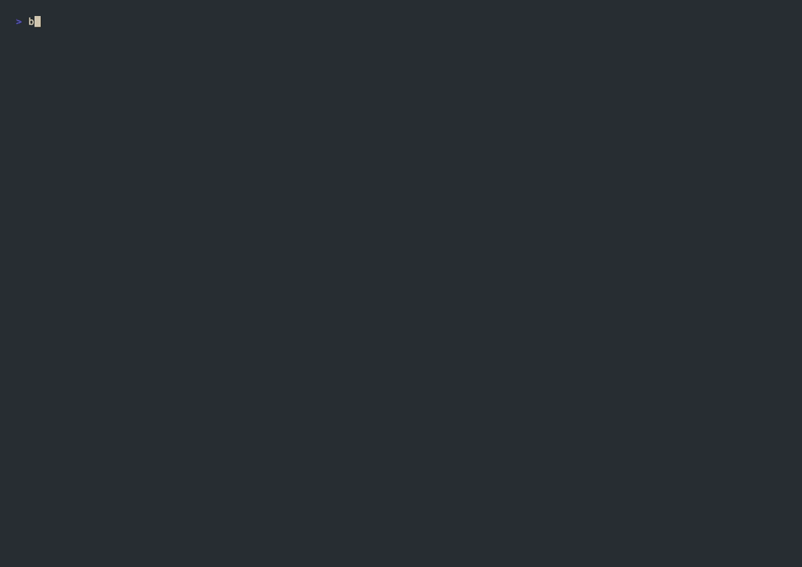
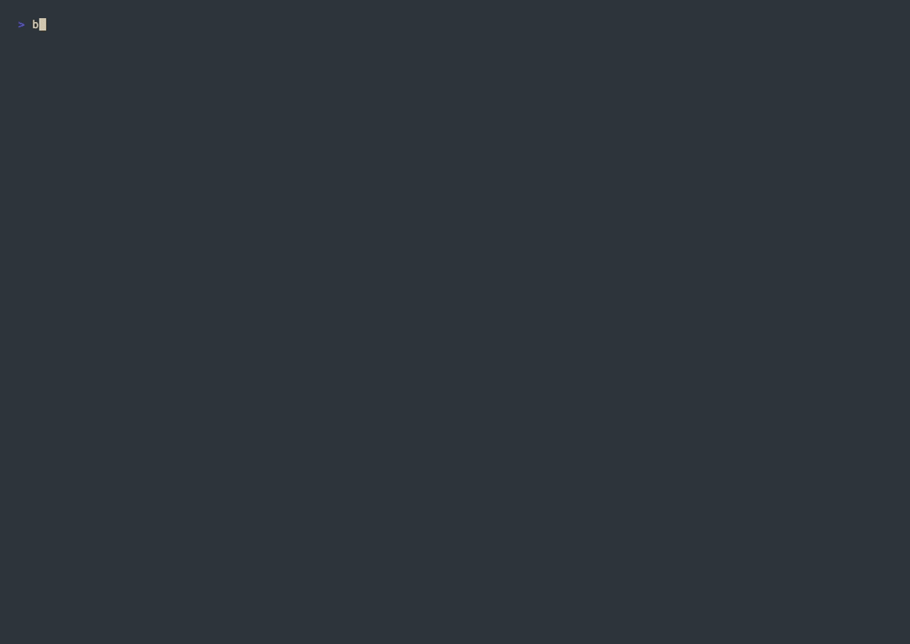
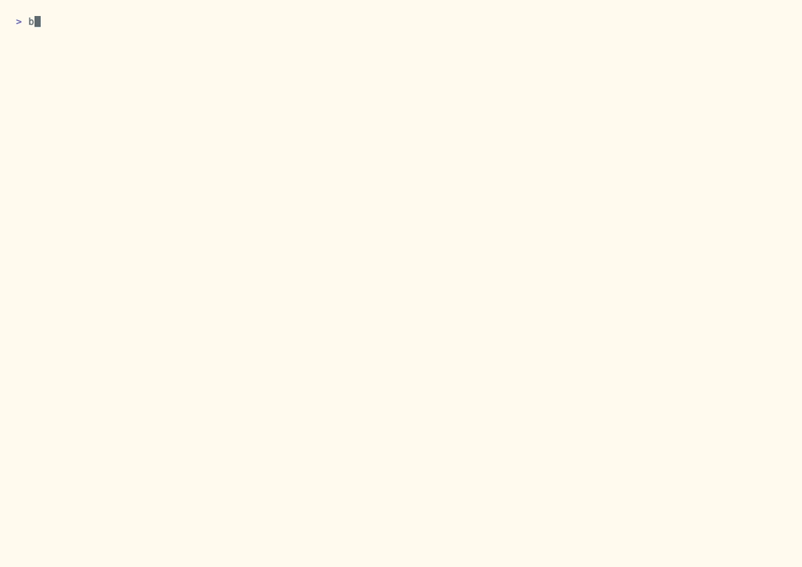
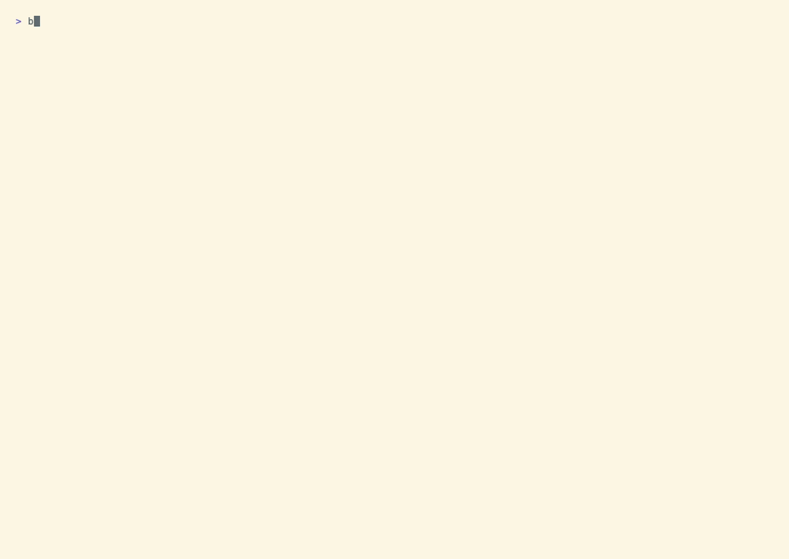
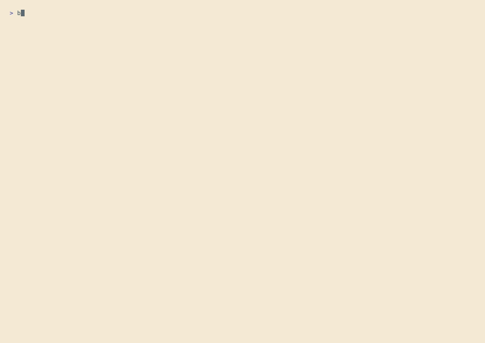

# ghostty-everforest

A port of [sainnhe's Everforest](https://github.com/sainnhe/everforest) colorscheme to [Ghostty](https://ghostty.org). Six variants covering dark/light × hard/medium/soft contrast levels.

## About

Everforest is a green-based colorscheme designed to be warm, soft, and easy on the eyes. This port faithfully maps the upstream palette to Ghostty's theme format, using sainnhe's own terminal ports (iTerm2 / Alacritty) as the canonical ANSI mapping reference.

Upstream: <https://github.com/sainnhe/everforest>

## Preview

**Dark variants**





**Light variants**





## Installation

### Option 1 — install.sh (recommended)

```sh
git clone https://github.com/mrap/ghostty-everforest.git
cd ghostty-everforest
./install.sh
```

The script detects macOS or Linux and copies the themes into the correct Ghostty themes directory, then prints the config snippet to use.

### Option 2 — manual drop

Copy any theme file from `themes/` into your Ghostty themes directory:

- **macOS:** `~/Library/Application Support/com.mitchellh.ghostty/themes/`
- **Linux:** `~/.config/ghostty/themes/`

```sh
cp themes/everforest-dark-medium \
  "~/Library/Application Support/com.mitchellh.ghostty/themes/"
```

### Option 3 — Ghostty config snippet

Add to your `~/.config/ghostty/config` (or `~/Library/Application Support/com.mitchellh.ghostty/config` on macOS):

```
theme = everforest-dark-medium
```

Replace `everforest-dark-medium` with any of the six variant names listed below.

## Variants

| Theme Name | Type | Contrast |
|---|---|---|
| `everforest-dark-hard` | Dark | Hard — deepest background (`#272e33`) |
| `everforest-dark-medium` | Dark | Medium — balanced background (`#2d353b`) |
| `everforest-dark-soft` | Dark | Soft — muted background (`#333c43`) |
| `everforest-light-hard` | Light | Hard — bright background (`#fffbef`) |
| `everforest-light-medium` | Light | Medium — warm background (`#fdf6e3`) |
| `everforest-light-soft` | Light | Soft — gentle background (`#f3ead3`) |

## Regenerating Screenshots

```sh
bash scripts/render-screenshots.sh
```

Requires: `python3` with `Pillow` (auto-installed via pip if absent). Renders all 6 variants to `screenshots/`.

## Credits

- Colorscheme by [sainnhe](https://github.com/sainnhe) — [Everforest](https://github.com/sainnhe/everforest)
- Ghostty terminal: [https://ghostty.org](https://ghostty.org)

## License

MIT — see [LICENSE](LICENSE).
